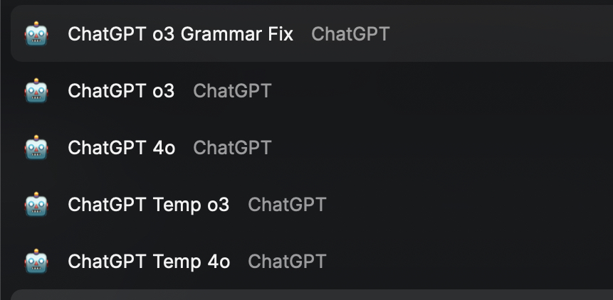

# Raycast ChatGPT Launcher Scripts

A collection of Raycast scripts for quickly launching ChatGPT with different models and configurations.



## Scripts Overview

### 🤖 chatgpt-4o.sh
Opens ChatGPT with the GPT-4o model in your default browser. Optionally accepts a query parameter.

### 🤖 chatgpt-o3.sh
Opens ChatGPT with the o3 model in your default browser. Optionally accepts a query parameter.

### 🔒 chatgpt-temp-4o.sh
Opens ChatGPT with GPT-4o model in temporary chat mode (no chat history saved). Optionally accepts a query parameter.

### 🔒 chatgpt-temp-o3.sh
Opens ChatGPT with o3 model in temporary chat mode (no chat history saved). Optionally accepts a query parameter.

### ✏️ chatgpt-o3-grammar-fix.sh
Opens ChatGPT with o3 model and a specialized grammar correction prompt. Takes text as input and provides:
- Grammar and syntax corrections
- Improved readability version
- Three alternative style variations

## Installation

1. Copy the scripts to your Raycast scripts folder
2. Make sure scripts have executable permissions:
   ```bash
   chmod +x *.sh
   ```
3. Access scripts through Raycast command palette

## Requirements

- macOS
- [Raycast](https://www.raycast.com/) app installed
- Active ChatGPT account

## Usage

Simply search for the script name in Raycast and press Enter. All scripts now support optional query parameters - you can either:
- Run without parameters to open ChatGPT with the selected model
- Provide a query to immediately start a conversation with your question

For the grammar fix script, you'll be prompted to enter text that will be processed with a specialized grammar correction prompt.

## Author

Created by [@kregenrek](https://github.com/kregenrek)